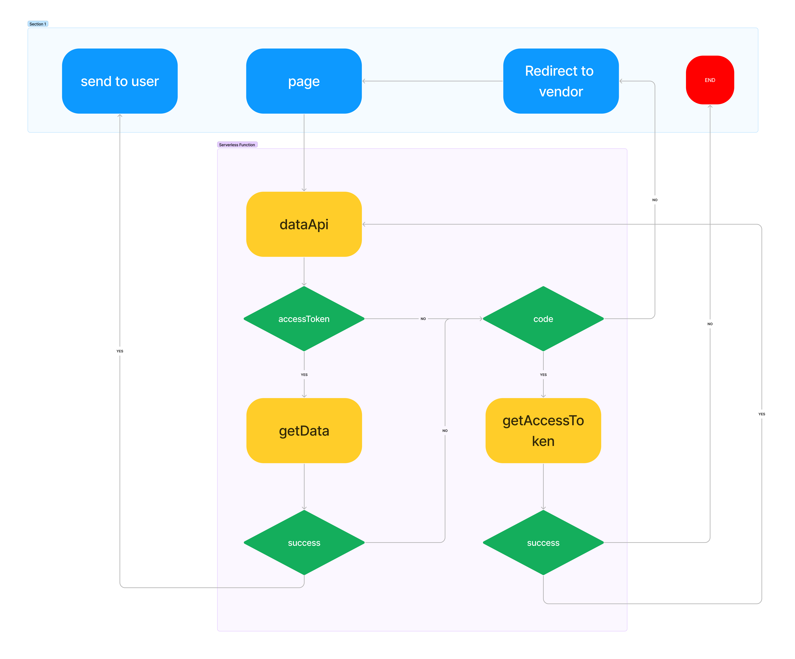

# Next oAuth

This is a Demo project to implement an oAuth library in NextJS. 

The library itself is in `pages/api/[route]/[api]/oath.ts`. Ideally, this would come as an npm package.

Data is requested from an api which redirects the user to Github and takes the code query param to exchange it with an access token. Data is then requested and returned to the client.

Note: This wont work without the appropriate environment variables.

DEMO: https://t6emtg-3000.preview.csb.app/

